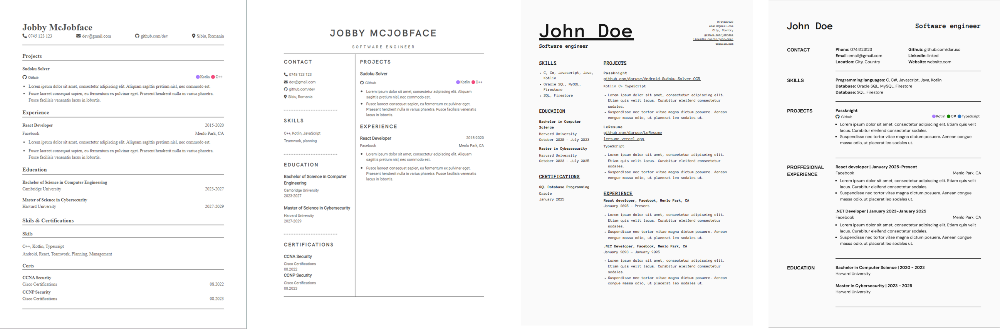

<h1 align="center">
  
</h1>

<h3 align="center">Resume builder & sharing platform</h3>

<h4 align="center"><a href="https://leresume.vercel.app">leresume.vercel.app</a></h4>

 

## Description

**LeResume** is powerful online platform designed to help users create professional resumes with ease.
Users can customize their resumes, generate multiple versions tailored to different job applications, and share them effortlessly via a personalized link or downloadable PDF.

##

 

  

### Features

- Build a professtional single page resume
- Add your coding projects directly from github
- Share your resumes with others
- See how many views your shared resumes got
- Previewing the resume in real time
- Can be used without an account (has some limitations)
- Multiple templates available

 

## Templates

  </img>

